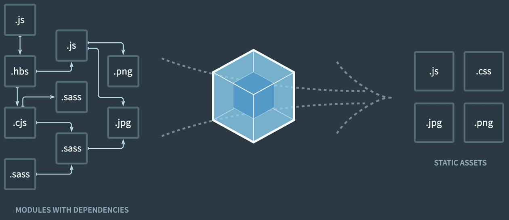
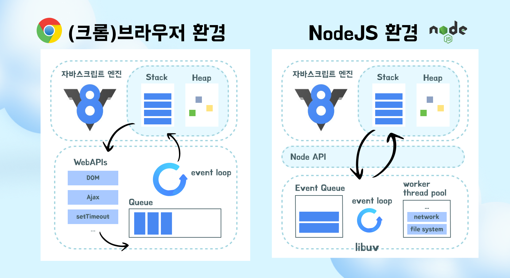

# SSR 과 CSR 이해하기 

### 🗣️ SSR 과 CSR 의 차이점에 대해 알아보자!

SSR은 서버 사이드 렌더링, CSR은 클라이언트 사이드 렌더링이다.
글자 그대로 SSR 은 서버에서 html을 만들고, CSR 은 브라우저에서 html을 만든다. 하지만 여기에는 몇가지 의문이 생길 수 있다.

> 💭 _ Nextjs 같은 프레임워크 없이 자바스크립트로 SSR을 구현하려면 어떻게 해야할까? nodejs 에서 html을 만드려면 어떻게 해야하지?_
> 💭 렌더링이 정확하게 뭘까? 서버에서 렌더링 되는 것과 클라이언트에서 렌더링 되는 방식에 어떤 차이가 있을까?
> 💭 여기서 말하는 렌더링과 브라우저 렌더링은 다른걸까?
> 💭 SSR에서 말하는 서버는 무엇일까? api 서버와는 다른걸까?

이러한 의문들을 해결하기 위해서는 웹의 발전 과정과 JavaScript 개발 환경에 대한 이해가 먼저 해결되어야 한다고 생각해서 간단하게 정리해보았다.

# 🕐 웹 개발의 역사적 타임라인

## 1. 초기 웹 (1990년대)

초기의 웹은 단순한 정적 HTML 파일을 제공하는 `순수한 SSR 형태`였다.

```html
<!DOCTYPE html>
<html>
  <head>
    <script src="./main.js"></script>
    <script src="./foo.js"></script>
  </head>
  <body>
    ...
  </body>
</html>
```

### 주요 문제점

- **전역 스코프 오염**: 각 모듈에 독립적인 스코프가 생성되지 않아 자바스크립트 파일들이 서로 영향을 주었다.
- **의존성 관리 문제**: 모듈 간 로딩 순서가 보장되지 않았다.
  예를 들어

```
<script src="jquery-plugin.js"></script>   <!-- jQuery가 없어서 에러 발생 -->
<script src="jquery.js"></script>

```

이 경우 의존성을 명시적으로 선언할 방법이 없어서 개발자가 수동으로 순서를 맞춰야 했다.

- **성능 저하**: 순차적 로딩으로 인한 성능 문제. 자바스크립트를 모두 로딩하는 동안 아무 동작도 하지 못했다.

## 2. 초기 해결 패턴 (2000년대 초반)

위와 같은 문제점을 해결하기 위해 다음과 같은 패턴들이 등장했다.

```jsx
// IIFE 패턴
var Module = (function () {
  var private = "private"; // 비공개 변수
  return {
    getPrivate: function () {
      // 공개 메서드
      return private;
    },
  };
})();

// 네임스페이스 패턴
var MyApp = MyApp || {};
MyApp.Module = {
  // 모듈 내용
};
```

이를 통해 전역 스코프 오염을 해결하고 , 모듈 단위로 구조화가 가능해졌다.
하지만 여전히 다음과 같은 한계점이 존재했다.

- 전역 객체(MyApp, Module) 생성 필요
- 수동적인 의존성 관리
- 모듈 재사용의 어려움
- 파일 단위 스코프 부재

## 3. AJAX의 등장 (2005)

자바스크립트의 중요성이 증가하면서 Ajax가 등장했다.
이를 통해 기본 페이지는 서버에서 생성하되(SSR) 비동기 데이터 통신이 필요한 부분은 ajax 를 통해 부분 업데이트가 가능해졌다.(CSR)
또한 JSON 기반 데이터 통신의 기초를 제공해 주었다.

```html
// 기본 페이지는 SSR로 제공
<!DOCTYPE html>
<html>
  <body>
    ... 생략
    <!-- 새 게시글 작성 폼 -->
    <form id="postForm">
      <input type="text" id="content" />
      <button type="submit">작성</button>
    </form>

    <script>
              // AJAX를 통한 부분 업데이트
              document.getElementById('postForm').onsubmit = function(e) {
                  e.preventDefault();

                  var xhr = new XMLHttpRequest();
                  xhr.open('POST', '/api/posts');
      ...생략

           // DOM 부분 업데이트
                  var postsDiv = document.getElementById('posts');
                  postsDiv.innerHTML += `
                              <div class="post">${newPost.content}</div>
                          `;
                      }
                  };
      ... 생략
    </script>
  </body>
</html>
```

## 4. V8 엔진 등장 (2008)

구글의 크롬이 부상하면서 구글에서 크롬 브라우저 용으로 v8 자바스크립트 엔진을 개발했다.
기존의 자바스크립트 엔진보다 빠르고 서버로 사용할 만큼 좋은 성능을 가졌다.

### 특징

- JIT(Just-In-Time) 컴파일 : V8이 실행 시점에 기계어로 컴파일. 인터프리터 방식보다 훨씬 빠른 실행 속도를 가지게 되었다.
- 효율적인 메모리 관리

> 왜 인터프리터보다 JIT 컴파일 방식이 더 빠를까?
- 인터프리터 : 매번 한 줄씩 해석하고 실행한다.
- JIT 컴파일 : 실행 시점에 필요한 코드를 기계어로 컴파일하고, 컴파일 된 코드를 캐싱하여 재사용한다. + 컴파일 과정에서 코드 최적화가 가능하다.

## 5. Node.js 등장 (2009)

nodejs 는 V8 엔진 기반의 서버사이드 자바스크립트 실행 환경이다.
node js는 자바스크립트를 서버로 활용하기 위한 도구가 될 수 있다.
기존의 자바스크립트는 웹 브라우저 위에서만 실행할 수 있었는데, 자바스크립트 런타임인 nodejs 가 등장한 이후 다른 환경에서도 자바스크립트를 실행할 수 있게 되었다.

- **브라우저 환경과 nodejs 서버 환경 비교하기**

> [브라우저 환경]
> Chrome Browser
> ├── V8 엔진 (JS 실행)
> ├── Web APIs (DOM, AJAX, Timer 등)
> └── Event Loop

> [Node.js 환경]
> Node.js Runtime
> ├── V8 엔진 (JS 실행)
> ├── libuv (비동기 I/O)
> └── Node.js APIs (fs, http 등)

## 6. 모듈 시스템의 발전

### CommonJS (2009)

commonjs 는 기존의 nodejs 문법에 모듈화가 추가된 모듈 시스템이다.
Node.js의 등장으로 자바스크립트를 범용적으로 쓰기 위해 표준화된 모듈 시스템이 필요해졌다. commonjs 는 이를 위해 등장했으며 다음과 같은 역할을 했다.

- 표준화된 모듈 시스템(require, export 로 독립적인 스코프 제공)
- 공통 패키지 모듈 저장소 (이후 npm으로 발전)

```jsx
const module = require("./module");
module.exports = function () {};
```

그러나 브라우저에서 해당 문법을 이해하지 못해서 별도의 번들러(webpack, browserify 등)가 필요했다.

### AMD (2009)

CommonJS의 브라우저 한계를 해결하기 위해 등장했다.

```jsx
define(["dependency"], function (dependency) {
  return {
    method: function () {},
  };
});
```

AMD 는 다음과 같은 특징이 있다.

- 브라우저 환경에 최적화
- 비동기 모듈 로딩 지원
- 의존성 명시적 선언
- RequireJS 같은 라이브러리를 통해 사용

그러나 문법이 복잡하고, 콜백 중첩이 발생하며 브라우저만을 위한 솔루션이었다.

## 7. Webpack 등장(2012)



여러 모듈 시스템이 나왔지만, 이러한 모듈 시스템을 잘 사용하기 어려웠다. 여기에는 다음과 같은 문제점이 있었다.

- 브라우저에서는 모듈들을 불러올 때 각각 네트워크 요청을 해줘야 한다.
- CommonJS, AMD, UMD 등 서로 다른 모듈 시스템 문법.

이러한 모듈 시스템을 잘 사용하기 위해 모듈 번들러들이 등장했다.

웹팩은 모듈 번들러 중 하나로 모든 파일을 모듈로 관리한다.

```
// 예시
import sum from './math';
import './style.css';
import logo from './logo.png';

```

웹팩은 4가지 주요 기능이 있다

1. entry-output : import/require 로 연결된 모든 파일 수집하며 의존성 그래프를 그린다.
2. loader : 모든 파일들을 js에서 다룰 수 있는 형태로 만든다.(즉, 브라우저에서 이해할 수 있는 코드로 만든다.)
   ex) 이미지 → 파일 경로 문자열 또는 Base64 문자열 (file-loader)
   CSS → DOM에 스타일을 주입하는 JavaScript 코드 (css-loader)
   ES6 → ES5 (babel-loader)
3. 번들링
4. plugin : 번들된 결과물을 처리,최적화 한다. js를 난독화 하거나 css 를 추출하는 등의 기능을 할 수 있다.

이 과정을 거치며 babel, polyfill 등의 기능 또한 함께 제공되는데, 자세히 알아보자

### polyfill

폴리필은 es6 를 es5 이전 문법으로 변환할 때 없는 메서드나 객체를 직접 구현해주는 역할을 한다.
즉, 기능 자체를 추가해주기 때문에 폴리필이 없다면 참조 에러(ReferenceError)를 마주칠 수 있다.

```
// 원본 코드
const arr = [1, 2, 3];
arr.includes(2);
new Promise();

// Polyfill 추가 후
if (!Array.prototype.includes) {
    Array.prototype.includes = function(item) {
        return this.indexOf(item) !== -1;
    }
}
if (!window.Promise) {
    window.Promise = function() {
        // Promise 구현
    }
}
// ✅ 이제 includes와 Promise 사용 가능

```

### Babel (2014)

바벨은 es6 를 es5로 변환시켜주는 트랜스파일러이다.
새로운 문법을 옛날 문법으로 변환시켜주며 다음과 같은 기능 또한 지원해준다.

- JSX 트랜스파일링 지원
- TypeScript 지원: 타입스크립트를 자바스크립트로 변환
  단, 타입 체크가 안되기 때문에 컴파일 시 타입체크를 하고 싶다면 TypeScript 컴파일러를 사용하거나 ts-loader 를 사용해야한다.

만약 바벨이 없다면 자바스크립트가 구문을 못 알아들어 syntax error가 날 수도 있다.

```
// 원본 코드 (ES6+)
const arrowFn = () => {};
class MyClass {}

// Babel 변환 후 (ES5)
var arrowFn = function() {};
function MyClass() {}

```

## 8. ES6(ES2015) 발표 (2015)

ESM은 특정 환경(브라우저/서버)만을 위한 솔루션이 아닌, 자바스크립트의 통합된 모듈 시스템이다.

```jsx
import { function } from './module';
export const newFunction = () => {};

```

기존 commonjs 만 지원해주던 라이브러리들이 esm 을 지원하기 시작했다.
ex) typescript, nextjs, jest
추가로, 최근 등장한 오픈소스 중 commonjs 지원을 없앤 경우도 존재한다.
ex) vite

> commonJs vs ESM

- esm 은 트리쉐이킹 가능, cjs 는 불가. cjs 는 동적 import 로 빌드 타임에 어떤 값이 불러와서 사용해질 수 있는지 가늠하기 어렵다.(cjs 자체가 트리쉐이킹이 불가한게 아니라 동적 import 가 불가한 것.)
- esm 은 cjs 보다 느림. cjs 는 동기적으로 실행되나, esm 은 전체 모듈 그래프가 구문 분석된 후 다음 코드가 평가되어 느리다.
- cjs 는 조건에 따른 require 이 가능해서 동적 로딩, 지연 로드 등에 유용하다.

> node package manager(npm)
> npm 을 통해 모듈을 배포가 가능하고, 외부의 모듈을 설치할 수 있다. 초기에는 nodejs 모듈에 한정되었지만, 최근에는 자바스크립트 패키지 매니저로 확장됐다.
> *package.json*은 설치한 모듈들의 메타데이터와 의존성을 정의하는 파일이다. 기본적으로 commonjs 문법을 사용하지만, 이 파일에 "type": "module" 설정을 추가해주면 esm을 기본 모듈시스템으로 사용 가능해진다.

## 9. 마무리

마지막으로 렌더링 환경을 정리해보자(정확한 구조는 지금 알 필요 없지만 그려봤다)



사실 이 정보만으로는 위의 의문에 대답할 수 없다.
하지만,
CSR(여기서는 리액트)이 보낸 bundle.js 를 `브라우저에서 렌더링`하여 html을 만든다! 의 의미와,
SSR이 `서버(여기서는 NodeJS)에서 렌더링` 하여 html을 만든다! 가 무슨 의미인지는 알 것이다.

즉

> 리액트(CSR) -> ts,jsx,es6 ...웹팩으로 번들링(es5이전 버전으로 트랜스파일링, 최적화) -> 브라우저가 bundle.js 받고 DOM,CSSOM tree 그린 후 자바스크립트 엔진으로 자바스크립트를 실행함.(브라우저 렌더링)
> //사실 v8은 es6도 지원되나, 구형브라우저를 위해 트랜스파일링

> SSR(nodejs를 이용한 순수 SSR) -> nodejs 에서 자바스크립트를 실행하여 html 생성 -> 브라우저로 보냄 -> 브라우저에서 DOM+CSSROM tree 그림 (브라우저 렌더링)

앞으로 나올 CSR, SSR을 이해하기 위한 바탕이 완성됐다!

---

레퍼런스

- [모듈 시스템](https://medium.com/@hong009319/%EC%9E%90%EB%B0%94%EC%8A%A4%ED%81%AC%EB%A6%BD%ED%8A%B8%EC%9D%98-%ED%91%9C%EC%A4%80-%EC%A0%95%EC%9D%98-commonjs-vs-es-modules-306e5f0a74b1)
- [nodejs](https://urmaru.com/8)
- [v8엔진](https://ui.toast.com/weekly-pick/ko_20200228)
- [웹팩](https://ehddnjs8989.medium.com/webpack%EC%97%90-%EB%8C%80%ED%95%B4%EC%84%9C-%EC%95%8C%EC%95%84%EB%B4%85%EC%8B%9C%EB%8B%A4-c953181e79ad)
- [nodejs 와 브라우저 event loop 차이](https://dev.to/jasmin/difference-between-the-event-loop-in-browser-and-node-js-1113)
