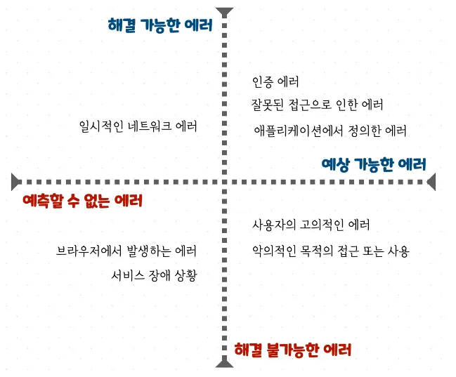

# 프론트엔드 에러 핸들링

## 목차

1. 프론트엔드에서 에러란?
2. 에러 분류하기
3. 에러를 처리하는 방법
   1. 글로벌 에러 처리
   2. 선언적으로 에러 처리하기(errorBoundary)
4. errorBoundary 에서 에러를 처리할 수

## 프론트엔드에서 에러란?

소프트웨어에서의 에러는 컴파일 에러, 런타임 에러로 나눌 수 있다.

컴파일 에러란 컴파일 시 컴파일러가 해석하지 못해서 발생하는 경우를 뜻한다. 예를 들어 잘못된 타입을 사용했을 때 나타날 수 있다. 이러한 컴파일 에러는 TypeScript를 사용하여 방지할 수 있다.

런타임 에러란 프로그램이 동작할 때 발견할 수 있는 에러이다. 존재하지 않는 DOM 요소에 접근하는 것을 예시로 들 수 있다.

컴파일 에러는 TypeScript, ESLint, Webpack 등의 도구를 이용해 캐치가 가능하다. 자바스크립트는 이러한 컴파일 에러가 아닌, 런타임 에러를 ‘예외’라고 부른다.

## 예외(에러)를 분류해보자.



> [클라이언트의 사용자 중심 예외 처리](https://jbee.io/articles/react/%ED%81%B4%EB%9D%BC%EC%9D%B4%EC%96%B8%ED%8A%B8%EC%9D%98%20%EC%82%AC%EC%9A%A9%EC%9E%90%20%EC%A4%91%EC%8B%AC%20%EC%98%88%EC%99%B8%20%EC%B2%98%EB%A6%AC)

웹 환경에서의 에러는 두 가지 기준으로 나눌 수 있다

1. 브라우저 환경에서- 예측 가능 vs 예측 불가능
2. 사용자가- 해결 가능 vs 해결 불가능

### 1. 예측 가능하며 사용자가 해결할 수 없는 에러

고의적으로 비정상적인 접근을 한 경우이다. 이는 보안과 관련되어있고 CORS, XSS 등을 고려해야 한다.

### 2. 예측 불가능하고 사용자가 해결할 수 없는 에러

`HTTP 상태 코드 500` 번대 오류로 서비스 장애, 특정 브라우저에서 나타나는 호환성 오류, 저사양 기기 사용 오류 등이 있다.

Sentry 등의 모니터링 도구를 활용하여 대응해야 하며, 사용자가 고객센터 문의 등을 활용할 수 있도록 해야한다.

### 3. 예측 불가능하며 사용자가 해결할 수 있는 에러

`네트워크` 오류가 이에 해당한다. 일시적인 문제임을 알리고, 재시도 가이드를 제공해야한다.

일시적인 에러로 모든 부분의 요청이 막히면 사용자에게 불편한 경험을 제공하게 되어서 에러의 영향 범위를 최소화 하는게 중요하다.

### 4. 예측 가능하며 사용자가 해결할 수 있는 에러

`HTTP 상태 코드가 명확한 에러`이다. 미리 정의되고 예상된 상황에서 발생한다.

인증 에러 ,잘못된 접근으로 인한 에러 등 400대 에러가 이에 해당한다.

각 상태 코드에 따른 적절한 가이드와 별도 에러 페이지를 제공해야한다.

예를 들어 인증 오류의 경우에는 사용자가 로그인을 시도할 수 있도록 유도해야 하며, 권한 오류의 경우에는 관리자에게 권한 요청을 하여 사용자 스스로 해결할 수 있어야 한다.

이렇게 에러의 예측, 해결 가능 여부에 따라 적절한 대응 방법으로 에러를 핸들링 할 수 있다.

### 추가 고려사항

- 에러는 최대한 작은 범위에서 catch해야 한다.
  화면에 여러 api 요청이 있을 때 하나의 요청에서 에러가 난다면, 다른 요청에는 영향을 미치지 말아야 한다. 따라서 요청이 일어나는 각 컴포넌트 마다 적절하게 에러를 핸들링 해 주어야 한다.
- HTTP Status를 기준으로 처리되는 에러에는 '합의된 에러'임을 나타내는 flag 값을 사용할 수 있다.
  이 중 `예측 가능하며 사용자가 해결할 수 있는 에러` 의 경우에는 백엔드와 합의하여 각 상태에 따른 에러코드를 정리해두는 게 좋다.
  예를 들어
  **400 Bad Request** 의 에러 코드를 받았을때를 생각해보자.
  지피티 사용하기
  400대 에러 상황 예시 적어주고, 400 대 에러 상태코드를 분리할 수 있는 상황으로,

## 에러를 처리하는 방법

> https://happysisyphe.tistory.com/52

> https://velog.io/@baby_dev/공식에서의-에러핸들링-feat.-에러-바운더리

1. 에러 처리 방법들(onError, try-catch 등등)
2. 선언적으로 에러 처리하는 것의 장점 + errorBoundary

에러를 처리하는 방법은 여러가지가 있다.

보통은 try-catch 문으로 에러를 처리할 수 있다.

```jsx
코드;
```

만약 tanstack-query 를 사용한다면 onError 를 활용하는 방법도 있다.

```jsx
코드
```

여기서 오는 단점들(명령형)


선언형 처리인 errorBoundary 설명

```jsx
코드
```

전역적인 에러처리의 장점.


### 상황에 따른 에러처리
get, fetch , post 등에 따라 보여줄 수 있는 에러 상황

예를 들어 get 에서는 각 상태에 따라 에러 페이지를 보여줄 수 있고, post 같은 경우에는 toast를 해주는게 페이지 전환을 하는 것 보다 좋을 것 이다.

→ 이 경우에는 에러 바운더리 설정보다는 query 의 설정으로 .

```jsx
에러를 처리하는 방법에 관련된 코드.
```

각 컴포넌트 마다 에러바운더리 감싸는 것과 , 여기서 잡지 못해서 글로벌로 잡는 에러,

즉 fetch 로직에서 에러를 던질때 커스텀 에러로 던짐, → 에러 상태코드에 따라 다른 메세지 전달 →

## 에러 핸들링 설계 및 실제 프로젝트에서 적용한 에러 핸들링

> https://velog.io/@himprover/프론트엔드-에러-핸들링에-대한-고민

1. 에러 코드 상세하게 분류(각 상태코드에서도 code 를 분류할 수 있다.), 요청 시 에러 catch

1. 실제 프로젝트에서 적용한 에러는 추후 추가하도록 하겠습니다🥹

## 기타

> https://happysisyphe.tistory.com/66

1. errorBoundary 로 잡히지 않는 에러
